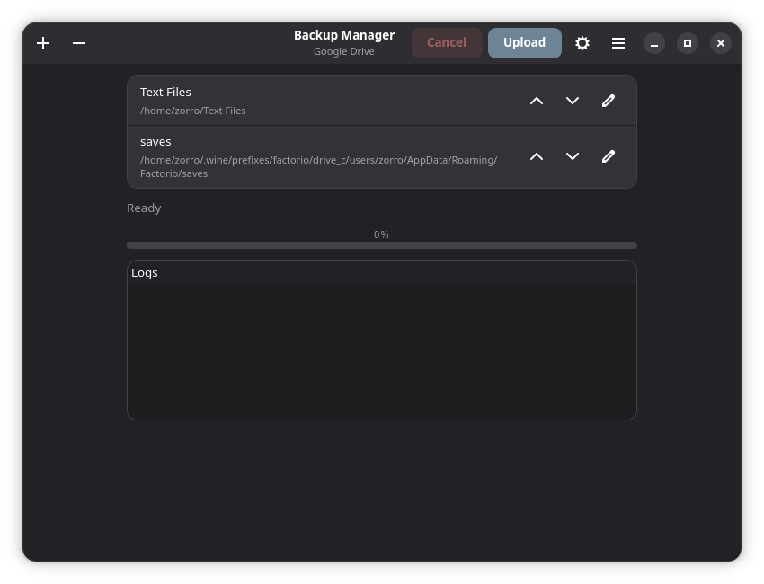
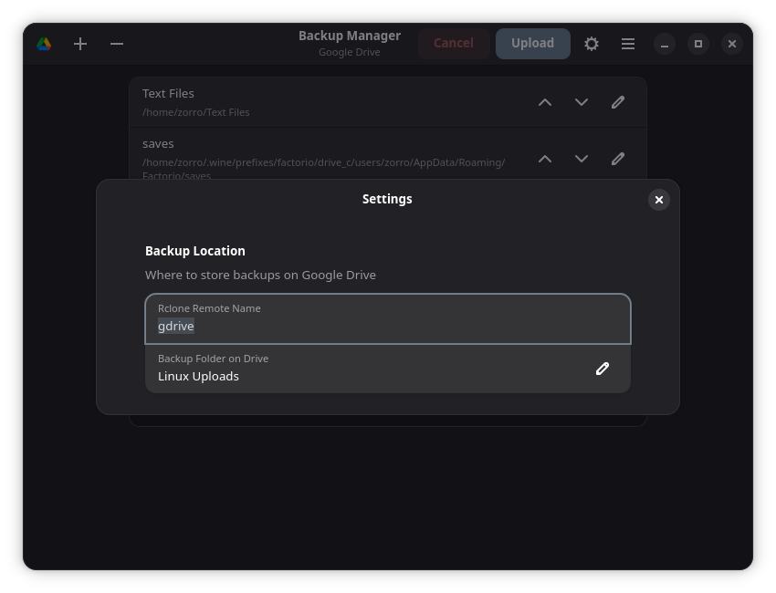

# Google Drive Backup Manager

A native Fedora GNOME application for manually backing up selected folders to Google Drive using `rclone`. Built with Python 3, GTK4, and Libadwaita for a polished Linux desktop experience.


## Features

- 🎨 **Native GNOME UI** - Modern Libadwaita interface with automatic dark mode support
- 📁 **Easy Folder Management** - Add, edit, remove, and reorder backup folders
- 📊 **Live Progress Tracking** - Real-time upload progress with detailed logs
- ⏸️ **Cancel Anytime** - Stop uploads instantly without data loss
- 🔒 **Secure** - Uses rclone's official Google Drive integration
- 💾 **Persistent Config** - Settings saved automatically
- ⚠️ **Smart Validation** - Detects missing drives and invalid paths
- 🎯 **Custom Destination** - Choose where on Google Drive to store backups

## Screenshots

*Add your screenshots to the `screenshots/` directory and reference them here:*




## Installation

### Prerequisites

**Fedora/RHEL:**
```bash
sudo dnf install python3-gobject gtk4 libadwaita rclone
```

**Ubuntu/Debian:**
```bash
sudo apt install python3-gi python3-gi-cairo gir1.2-gtk-4.0 gir1.2-adw-1 rclone
```

**Arch Linux:**
```bash
sudo pacman -S python-gobject gtk4 libadwaita rclone
```

### Quick Install

```bash
# Clone the repository
git clone https://github.com/yourusername/gdrive-backup-manager.git
cd gdrive-backup-manager

# Make scripts executable
chmod +x install.sh uninstall.sh

# Install the application
sudo ./install.sh
```

The application will now appear in your GNOME Applications menu as "Google Drive Backup Manager".

### Development Mode

Run without installation:
```bash
python run.py
```

## Usage

### First-Time Setup

1. **Launch the application** from your Applications menu or terminal
2. **Configure Google Drive** (see [Google Drive Setup](#google-drive-setup) below)
3. **Add folders** to backup:
   - Click the **+ (Add)** button
   - Browse to select a folder or paste the path manually
   - Click "Open" to confirm

### Managing Folders

- **Reorder**: Use ↑ ↓ arrows to change backup order
- **Edit**: Click the ✏️ pencil icon to modify folder details
- **Remove**: Select a folder and click the **- (Remove)** button
- **Validation**: Warning icon ⚠️ appears for missing/inaccessible folders

### Starting a Backup

1. Click the **Upload** button
2. Monitor progress in the log window
3. Click **Cancel** to stop at any time
4. Completed backups are stored on Google Drive in your configured location

### Customizing Backup Location

1. Click the **⚙️ Settings** button (gear icon)
2. Configure:
   - **Rclone Remote Name**: Your rclone remote (default: `gdrive`)
   - **Backup Folder on Drive**: Destination path on Google Drive (e.g., `Backups`, `My Backups/Important`)
3. Click "Apply" to save

Files will be uploaded to:
```
Google Drive > [Backup Folder] > [Folder Name] > [Your Files]
```

## Configuration

### Config File Location

```bash
~/.config/gdrive-backup-manager/config.json
```

### Config Structure

```json
{
  "folders": [
    {
      "name": "Documents",
      "path": "/home/user/Documents"
    }
  ],
  "settings": {
    "rclone_remote": "gdrive",
    "backup_root": "Backups"
  }
}
```

### Environment Variables

You can override default paths:

```bash
# Custom config location
export XDG_CONFIG_HOME=/custom/config

# Custom data/logs location
export XDG_DATA_HOME=/custom/share
```

### Log Files

Logs are stored in:
```bash
~/.local/share/gdrive-backup-manager/logs/
```

Each session creates a new timestamped log file.

## Google Drive Setup

### Step 1: Install rclone

See [Prerequisites](#prerequisites) for your distribution.

### Step 2: Configure Google Drive Remote

```bash
rclone config
```

Follow these steps:

1. Type `n` for **New remote**
2. Name it: `gdrive` (or your preferred name)
3. Choose storage: `drive` (Google Drive)
4. **client_id**: Leave blank (press Enter)
5. **client_secret**: Leave blank (press Enter)
6. **Scope**: Choose `1` (Full access)
7. **Root folder ID**: Leave blank (press Enter)
8. **Service Account Credentials**: Leave blank (press Enter)
9. **Edit advanced config**: `n`
10. **Use auto config**: `y`
    - This opens your browser to authenticate with Google
    - Sign in and grant permissions
11. **Configure as Shared Drive**: `n` (unless using Team Drive)
12. Type `q` to **Quit**

### Step 3: Verify Connection

```bash
rclone lsd gdrive:
```

You should see your Google Drive folders listed.

### Step 4: Test in App

1. Open Google Drive Backup Manager
2. Click **⚙️ Settings**
3. Ensure "Rclone Remote Name" matches your rclone remote (default: `gdrive`)
4. Set your preferred backup folder
5. Add a test folder and upload

## Project Structure

```
gdrive-backup-manager/
│
├── app/
│   ├── __init__.py
│   ├── config.py           # Configuration management
│   ├── logger.py           # Logging setup
│   │
│   ├── backend/
│   │   ├── __init__.py
│   │   └── uploader.py     # Rclone upload backend
│   │
│   └── ui/
│       ├── __init__.py
│       ├── application.py  # Main GTK application
│       └── main_window.py  # Main window UI
│
├── resources/
│   ├── icon.svg            # Application icon
│   └── gdrive-backup-manager.desktop
│
├── run.py                  # Application entry point
├── install.sh              # Installation script
├── uninstall.sh            # Uninstallation script
├── requirements.txt        # Python dependencies
├── README.md
├── LICENSE
└── .gitignore
```

## Troubleshooting

### "rclone: command not found"

Install rclone for your distribution (see [Prerequisites](#prerequisites)).

### "Configuration error: gdrive remote not found"

Run `rclone config` and ensure you have a remote named `gdrive` (or update the app settings to match your remote name).

### "Folder is missing or inaccessible" ⚠️

- The folder path doesn't exist
- The drive is unmounted (external drives, network shares)
- Permission denied (check folder permissions)

**Solution**: Either mount the drive or remove the folder from the backup list.

### Upload fails with "Permission denied"

1. Check rclone authentication: `rclone lsd gdrive:`
2. Re-authorize if needed: `rclone config reconnect gdrive:`
3. Ensure you have write access to the Google Drive folder

### "Unexpected Error" dialog appears

1. Check the logs: `~/.local/share/gdrive-backup-manager/logs/`
2. Look for the most recent log file
3. Review the error message
4. If it's a bug, [open an issue](https://github.com/yourusername/gdrive-backup-manager/issues)

### App won't launch from Applications menu

Run from terminal to see errors:
```bash
python /opt/gdrive-backup-manager/run.py
```

### Dark mode not working

The app follows your system theme. To force dark mode:
1. Open GNOME Settings → Appearance
2. Select "Dark"
3. Restart the app

## Roadmap

### Planned Features

- [ ] **Scheduled Backups** - Automatic backups at set intervals
- [ ] **Pause/Resume** - Pause ongoing uploads and resume later
- [ ] **Desktop Notifications** - Notify on upload complete/failure
- [ ] **Compression** - Compress folders before upload
- [ ] **Encryption** - Client-side encryption before upload
- [ ] **Multiple Profiles** - Save different backup configurations
- [ ] **Multiple Cloud Providers** - Support Dropbox, OneDrive, etc.
- [ ] **Restore Functionality** - Download backups from Google Drive
- [ ] **Backup Verification** - Verify uploaded files match source
- [ ] **Bandwidth Limiting** - Control upload speed
- [ ] **File Filters** - Exclude specific file types or patterns
- [ ] **Backup History** - View past backup dates and sizes

### Under Consideration

- [ ] System tray integration
- [ ] Incremental backups (only changed files)
- [ ] Backup size estimation
- [ ] Conflict resolution options
- [ ] Proxy support

## Contributing

Contributions are welcome! Please follow these guidelines:

### Code Style

- Follow **PEP 8** style guide
- Use **type hints** for function parameters and return values
- Add **docstrings** to classes and public methods
- Keep functions small and focused
- No duplicate code (DRY principle)

### Development Workflow

1. **Fork** the repository
2. **Clone** your fork:
   ```bash
   git clone https://github.com/yourusername/gdrive-backup-manager.git
   cd gdrive-backup-manager
   ```
3. **Create a branch**:
   ```bash
   git checkout -b feature/your-feature-name
   ```
4. **Make changes** and test thoroughly
5. **Commit** with clear messages:
   ```bash
   git commit -m "Add: new feature description"
   ```
6. **Push** to your fork:
   ```bash
   git push origin feature/your-feature-name
   ```
7. **Open a Pull Request** on GitHub

### Testing

Before submitting a PR:

- [ ] Test on Fedora (primary target)
- [ ] Test on Ubuntu/Debian if possible
- [ ] Verify no crashes on invalid input
- [ ] Check logs for errors
- [ ] Test with and without internet connection

### Reporting Issues

When filing a bug report, include:

- **Distribution** (e.g., Fedora 38, Ubuntu 22.04)
- **Python version** (`python --version`)
- **GTK/Libadwaita version**
- **Steps to reproduce**
- **Expected behavior**
- **Actual behavior**
- **Relevant logs** from `~/.local/share/gdrive-backup-manager/logs/`

## License

This project is licensed under the MIT License - see the [LICENSE](LICENSE) file for details.

## Acknowledgments

- [GTK4](https://docs.gtk.org/gtk4/) - Modern GTK toolkit
- [Libadwaita](https://gnome.pages.gitlab.gnome.org/libadwaita/doc/) - GNOME design patterns
- [rclone](https://rclone.org/) - "rsync for cloud storage"
- [PyGObject](https://pygobject.readthedocs.io/) - Python bindings for GNOME

---

**Made with ❤️ for the Linux community**

For questions or support, [open an issue](https://github.com/yourusername/gdrive-backup-manager/issues) on GitHub.
